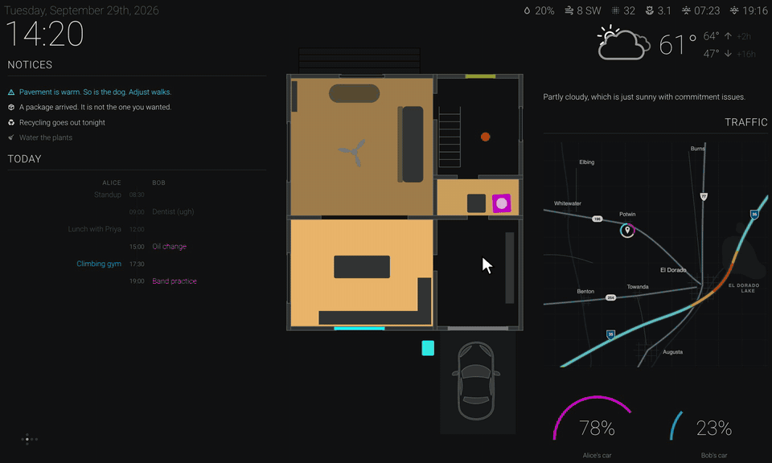

<p align="center"></p>

<p align="center">
  <a href="https://github.com/ste-haus/cube/actions/workflows/ci.yml"></a>
  <a href="https://github.com/ste-haus/cube/tags"></a>
  <a href="https://github.com/ste-haus/cube/pkgs/container/cube"></a>
  <a href="LICENSE"></a>
  <a href="https://www.home-assistant.io"></a>
</p>

# cube

A Home Assistant wall panel that runs outside Home Assistant.

**Setting one up? Start with [docs/setup.md](docs/setup.md).** The rest of this file is how the thing works; `docs/` is how to use it.

Home Assistant's own dashboards are good, and a wall panel is an awkward fit for them: it renders one fixed layout forever, and every panel that opens one holds its own websocket subscribed to the whole event bus. cube serves the same panel from a small proxy instead — one upstream connection for the whole house, an entity allowlist, and a frontend that is plain HTML and CSS rather than a stack of custom cards.

The panel presents itself as a cube. The dashboard is the front face; swiping, arrow keys, or the face map in the corner rotate to the other five.

## Design

cube borrows its look from a glass cockpit. Everything is drawn light on a black field (negative polarity, in display terms), the way an aircraft's flight displays are, because a wall panel has the same job: it sits in the corner of your eye, and it should read at a glance from across the room, in daylight or at 2am, without lighting the room up.

Most of the other choices follow from that:

- **Glanceable first.** A face should answer its question in a second or two. Large numerals, few words, and color that means something; grey is the resting state, and color is saved for what has changed or wants attention.
- **Dark when nothing is wrong.** This is the "dark cockpit" idea: a normal house shows nothing alarming, so anything lit is worth looking at. The master warning and master caution lights on every face come straight from the annunciator panel; they stay dark until Home Assistant has something to say, and stay lit until it's cleared.
- **Motion only when it means something.** A settled panel is still. A master light flashes when it comes on, then settles into a slow breathe; an announcement types out at about speaking pace; nothing glows for the sake of glowing.
- **One job per face.** Rather than one long scrolling dashboard, the panel is a cube, and each face is given over to one thing: the house, the weather, the cameras. Turning to a face is deliberate, and a face that's turned away rests instead of streaming.
- **Always know where you are.** The face map in the corner shows which way the cube is facing, and every face names itself up its left edge.

<p align="center"></p>

## How it works

```
Home Assistant                    cube proxy                      panels
──────────────                    ──────────                      ──────
  websocket  ──── one conn ─────▶  state cache  ──── ws ────────▶  panel
  REST       ──── on demand ────▶  camera relay ──── http ──────▶  panel
                                                                   panel
resources/   ──── from disk ────▶  floorplans   ──── http ──────▶  panel
```

The proxy holds the Home Assistant token, subscribes once through `subscribe_entities`, and fans compressed state diffs out to however many panels are connected. Panels never authenticate to Home Assistant and cannot reach anything the config does not name.

That arrangement is the point rather than an implementation detail. Home Assistant serializes every state change once per subscriber, so N panels subscribed directly cost N copies of every event. Collapsing them to one connection makes that cost independent of how many panels are on the wall, and the allowlist means a chatty sensor that no panel renders is never serialized at all.

Each connected panel reads from its own bounded queue. A panel that stops draining loses its own oldest updates and repaints on reconnect; it cannot slow the upstream connection or any other panel.

## Documentation

`docs/` covers using cube — [setup](docs/setup.md), [configuration](docs/configuration.md), [floorplans](docs/floorplans.md), [panels and profiles](docs/panels.md), [camera faces](docs/cameras.md), [icons](docs/icons.md), and [troubleshooting](docs/troubleshooting.md). What follows here is the shape of the thing.

## Layout

```
├── docs/                   # how to set it up and configure it
├── config.yaml.dist        # the whole schema, with placeholder entities
├── config.yaml             # your installation (gitignored)
├── resources/              # floorplan drawings (gitignored, mounted)
├── setup.cfg               # package metadata and dependencies
├── requirements.txt        # pinned, generated by `make lock`
├── src/cube/               # the proxy
│   ├── dashboard.py        # config models and loader
│   ├── hass/               # websocket client, protocol, REST
│   └── api/                # routes
├── web/                    # the panel (Svelte + Vite)
└── tools/stub_hass.py      # a stand-in Home Assistant for development
```

## Configuration

Nothing about any particular home is compiled in. Two files describe an installation, and neither is tracked:

| Path | Holds |
|---|---|
| `.env` | Home Assistant URL and token, bind address, active profile |
| `config.yaml` | entities, labels, colors, thresholds, floorplans, profiles |
| `resources/` | floorplan drawings, and optional stylesheet overrides |

```bash
make init
```

That creates both from their samples and refuses to touch either if it already exists — a clobbered `.env` costs you a token, and a clobbered `config.yaml` costs you the whole inventory.

`config.yaml.dist` is the complete schema with placeholder entities, and is the reference for what can be configured.

### Profiles

A profile is a panel's identity — which cube faces it gets, which floorplan level it opens on, which media player its announcement overlay follows. One instance serves all of them:

```
/?profile=<key>  a named panel
/                falls back to $CUBE_PROFILE, then to the `default` profile
```

`default` is the template the others are built from rather than a panel itself: it defines all six faces and names no speaker. Every other profile is a delta against it, or against whichever profile its `inherits` names, so a panel states only what makes it different and a chain can be as long as it is useful. `media_player` is the one field that never inherits, because a panel quietly following another room's speaker is indistinguishable from one that works.

A face is `dashboard`, `blank`, one of the two camera walls — `camera-grid` and `camera-hero` — or `custom`, a page from `resources/faces/<page>/`, additive to the built-in ones and needing no rebuild. Config parameterises the cards a face already has; it does not compose them. A face is built when first turned to and kept, unpainted and with its timers released, so only the face being looked at does any work — a camera on a face turned away holds its last frame and stops fetching, and the dashboard's clock stops ticking. [Panels and profiles](docs/panels.md) has the whole of it.

### Floorplans

The floorplan is an SVG in which every drawn element carries an entity id as its DOM id. The panel finds elements that way and keeps a class on each one in step with its entity; nothing else connects the drawing to Home Assistant.

Drawings live in `resources/floorplans/`, named by the `image` field of each configured level, and are served from disk rather than fetched — a floorplan is a picture of somebody's home, so it is mounted alongside the container rather than committed or proxied. `resources/README.md` covers what a drawing has to provide.

Two stylesheets ship with the panel: `web/src/styles/floorplan.css` holds the generic class contract, and `floorplan-rooms.css` beside it holds the rules naming particular rooms and fixtures. A `resources/floorplan.css` is served over both, for changes that should not need a rebuild. The classes the panel sets are the contract all three are written against:

| Group | Classes applied |
|---|---|
| `lights`, `windows`, `fans`, `motion`, `sensors`, `vehicles` | `<group> active` when the state is one of `on`, `open`, `motion`, `movement`; otherwise `<group> inactive` |
| `doors` | `door open` for `open` or `open_exterior`, `door locked`, `door unlocked`, otherwise `door inactive <state>` |
| `bins` | `sensor <state>` for `home`, `away`, `out`, `in`; otherwise `sensor inactive` |

Lights additionally take their `brightness` as opacity and their `rgb_color` as fill.

Only `lights` and `fans` are tappable. A toggle is refused unless the entity is one some panel draws as a control (a light or fan on the floorplan, a configured toggle, or a control on a [guest face](docs/panels.md#the-guest-face)) **and** its domain is listed in `toggleable_domains`. Setting a value, such as a light's brightness, a cover's position, or the time an alarm goes off, is held to the same rule, with the domain one of `light`, `cover`, or `input_datetime`:

```
POST /api/toggle  {"entity_id": "light.kitchen"}                   → 204
POST /api/toggle  {"entity_id": "sensor.front_door"}               → 403
POST /api/set     {"entity_id": "light.kitchen", "value": 40}      → 204
POST /api/set     {"entity_id": "sensor.front_door", "value": 40}  → 403
```

## What it asks Home Assistant for

One websocket connection, and four REST paths. Nothing else is ever requested.

| Transport | Path | When | Notes |
|---|---|---|---|
| websocket | `/api/websocket` | continuously | `auth`, then one `subscribe_entities` over the allowlist, plus `call_service` per toggle or value set |
| REST | `/api/calendars/{entity_id}` | one call per configured calendar, every 5 minutes, per panel | merged, filtered, and sorted by the proxy |
| REST | `/api/camera_proxy/{entity_id}` | once per camera refresh, per panel, and only for cameras on the face being looked at | a still; this is what the panel actually uses |
| REST | `/api/camera_proxy_stream/{entity_id}` | never, as shipped | MJPEG relay, available but unused by the current panel |

Floorplan drawings and stylesheet overrides are not in that list: they come from `resources/` on disk. Nor is live video: a camera with `stream_type: go2rtc` is played from go2rtc by the panel directly, and cube only serves the still that stands in while it connects. Nothing else is ever requested — no state polling, no history, no service or config discovery.

Every REST call carries the long-lived token as a bearer header, and the camera routes refuse any entity the config does not name, so the proxy cannot be used to reach arbitrary Home Assistant paths.

The calendar and still-image paths are per panel rather than shared, so they scale the way a directly-connected panel would. Collapsing them — one cached agenda, one upstream camera stream fanned out — is the obvious next thing if the wall grows.

## Running

```bash
make install        # uv venv + editable install, and npm install
make run            # builds the frontend, then serves on :4096
```

With Docker, which builds and runs a single image containing both the API and the built panel:

```bash
docker compose up --build
```

Published images are on GitHub Container Registry, built for `linux/amd64`. Versions are tags, cut by CI on merge; a merge message carrying `#minor` or `#major` moves that part instead of the patch:

```bash
docker run -d \
  -p 4096:4096 \
  -e CUBE_HA_URL=http://homeassistant.example.com:8123 \
  -e CUBE_HA_TOKEN=... \
  -v ./config.yaml:/app/config.yaml:ro \
  -v ./resources:/app/resources:ro \
  ghcr.io/ste-haus/cube:latest
```

## Developing without Home Assistant

`tools/stub_hass.py` stands in for Home Assistant, speaking the same websocket and REST surfaces. It reads whichever config you point it at and invents plausible states for every entity in it.

```bash
make resources CONFIG=config.yaml.dist   # schematic drawings, if you have none yet
make stub CONFIG=config.yaml.dist        # a fake Home Assistant on :8123
make run                                 # cube against it
```

`make resources` writes one schematic SVG per configured level into `resources/floorplans/`, with a labelled cell per entity, so the wiring between entity, SVG element, and stylesheet class is visible without a real drawing.

Point it at your own `config.yaml` to check that config's wiring before deploying:

```bash
make stub CONFIG=config.yaml
```

For frontend work, Vite's dev server proxies the API through to the running proxy:

```bash
make run &     # or: uv run python -m cube
make dev       # http://localhost:5173, hot reloading
```

## Tests

```bash
make test      # pytest, then vitest
make lint      # ruff, then svelte-check
```

The Python suite covers the config schema, the allowlist and toggle guard, the API surface, and the websocket protocol end to end against a stub Home Assistant — including the handshake, the compressed-diff format, and service calls. The frontend suite covers the rotation graph.

## Dependencies

Declared in `setup.cfg` and pinned in `requirements.txt`, which the image build uses. Regenerate after changing a dependency:

```bash
make lock
```

## Prior art

This replaces a Lovelace dashboard, which itself replaced a hand-written panel from 2018: [ste-haus-archive/cube](https://github.com/ste-haus-archive/cube). The cube rotation is carried over from that original, along with the idea that a wall panel is better served by something small than by a general-purpose dashboard engine.
